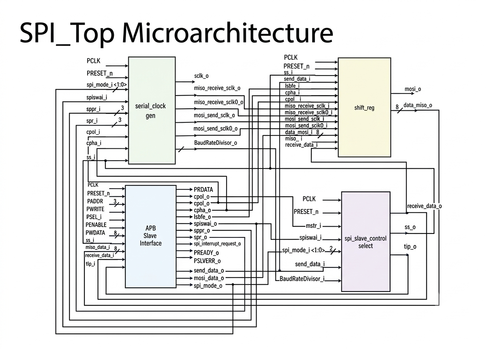
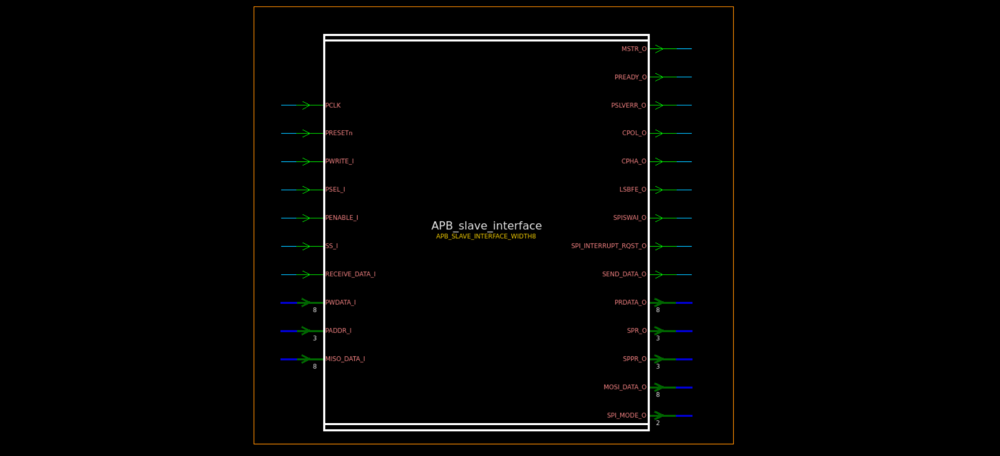
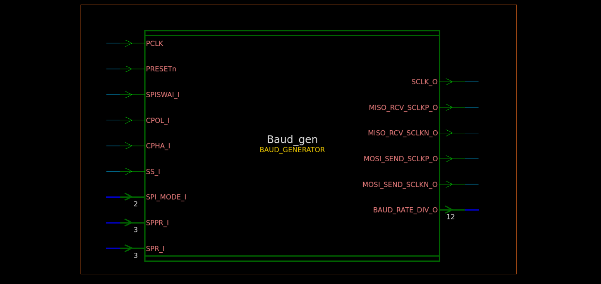
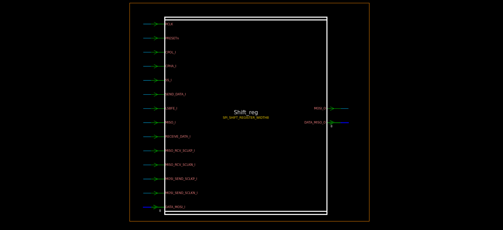
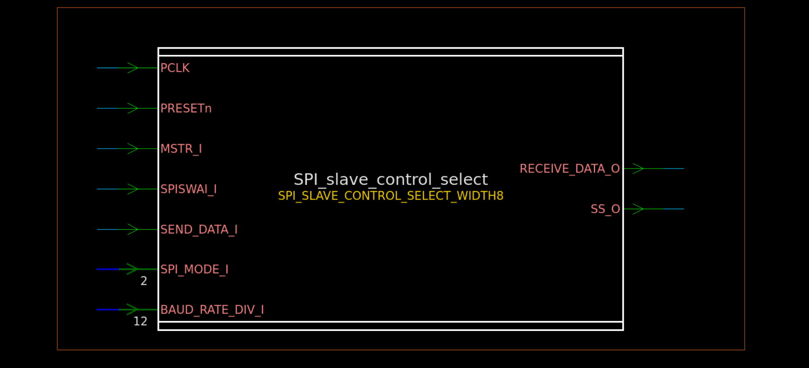
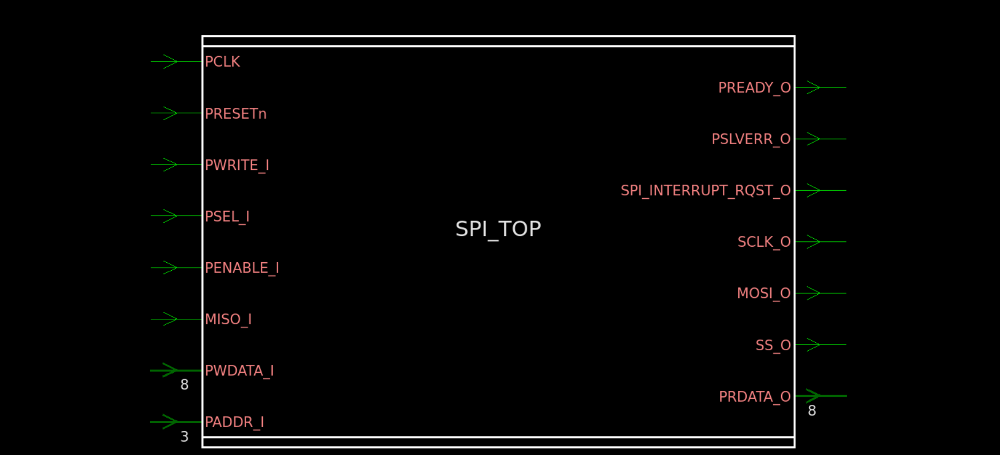

# 🔌 APB-Based SPI Master Controller

<p align="center">
  
  
  
  
  
  
</p>

<p align="center"><b>Parameterized APB-controlled SPI Master Controller implemented in synthesizable Verilog RTL</b></p>

---

## 📌 Project Overview

This project implements an **APB-based SPI Master Controller** in synthesizable Verilog HDL.

The controller provides an APB register interface for configuring the SPI peripheral, writing transmit data, reading received data, configuring SPI timing, and monitoring controller status.

### RTL hierarchy

| Module | Responsibility |
|---|---|
| `APB_SLAVE_INTERFACE.v` | APB transaction handling, control/status/data registers and interrupt logic |
| `BAUD_GENERATOR.v` | Programmable SPI clock generation and timing/edge pulses |
| `SPI_SHIFT_REGISTER.v` | Parallel-to-serial TX, serial-to-parallel RX and MOSI/MISO datapath |
| `SPI_SLAVE_CONTROL_SELECT.v` | Transfer timing/counting, SS generation and receive-data indication |
| `SPI_TOP.v` | Top-level integration of all functional blocks |

The design is parameterized through `WIDTH`; the reported synthesis configuration uses **WIDTH = 8**.

---

## ✨ Key Features

| Feature | Description |
|---|---|
| APB interface | APB-style IDLE, SETUP and ENABLE transaction handling |
| SPI master | Generates SPI serial clock and slave-select control |
| Parameterized datapath | Data width controlled by `WIDTH` |
| SPI configuration | CPOL, CPHA, master mode and bit-order fields |
| Programmable baud rate | SPPR/SPR based SPI clock division |
| TX/RX datapath | Separate transmit and receive handling |
| Status monitoring | SPIF, SPTEF and MODF status fields |
| Interrupt request | Interrupt generation from enabled status conditions |
| Synthesizable RTL | Written as synthesizable Verilog |
| Simulation | Verified using Vivado |
| Lint | Checked using Synopsys lint/SpyGlass flow |
| Synthesis | Synthesized using Synopsys Design Compiler |

---

# 🧱 Architecture

```text

<p align="center">
  
</p>

<p align="center">
  <b>Figure 1: SPI_TOP Microarchitecture</b>
</p>
               
```

---

# 🧩 RTL Module Description

## 1. `APB_SLAVE_INTERFACE.v`

<p align="center">
  
</p>

<p align="center">
  <b>Figure 2: APB Slave Interface</b>
</p>

The APB slave interface is the control and software-access block.

### Responsibilities

- Detects APB `IDLE`, `SETUP` and `ENABLE` phases.
- Generates `PREADY_O`.
- Generates the implemented `PSLVERR_O` condition.
- Implements control, baud, status and data registers.
- Stores SPI configuration.
- Provides transmit data to the SPI datapath.
- Receives completed SPI data.
- Generates `SPI_INTERRUPT_RQST_O`.

### Main configuration fields

- `MSTR`
- `CPOL`
- `CPHA`
- `LSBFE`
- `SPISWAI`
- `SPR`
- `SPPR`
- SPI interrupt enables

Register addresses are documented in `docs/register_map.md`.

---

## 2. `BAUD_GENERATOR.v`

<p align="center">
  
</p>

<p align="center">
  <b>Figure 3: Baud Generator</b>
</p>

The baud generator produces the SPI serial clock from `PCLK`.

### Responsibilities

- Calculates the programmable SPI division value.
- Generates `SCLK_O`.
- Initializes SCLK according to `CPOL`.
- Generates edge/timing indication pulses for the shift register.
- Uses `SPPR` and `SPR` for clock division.
- Holds SCLK at its configured idle level when inactive.

The RTL calculates:

```text
baud_div_1 = SPPR + 1
baud_div_2 = 2^(SPR + 1)

BAUD_RATE_DIV = baud_div_1 × baud_div_2
```

---

## 3. `SPI_SHIFT_REGISTER.v`

<p align="center">
  
</p>

<p align="center">
  <b>Figure 4: SPI Shift register</b>
</p>

This block implements the SPI serial datapath.

### Responsibilities

- Loads parallel transmit data.
- Shifts transmit data toward MOSI.
- Samples MISO according to generated timing events.
- Provides `MOSI_O`.
- Produces received parallel data.
- Supports parameterized data width.

Current reported configuration:

```text
WIDTH = 8
```

---

## 4. `SPI_SLAVE_CONTROL_SELECT.v`

<p align="center">
  
</p>

<p align="center">
  <b>Figure 5: SPI slave Control select</b>
</p>

This block manages transfer-level control.

### Responsibilities

- Generates `SS_O`.
- Detects transfer start.
- Maintains the transfer counter.
- Determines transfer completion.
- Generates the receive-data indication.
- Uses baud division and data width to determine transfer duration.

The RTL contains:

```verilog
wire [15:0] MAX = BAUD_RATE_DIV_I << logb2(WIDTH);
```

For `WIDTH = 8`:

```text
log2(8) = 3
```

The exact currently enabled SPI-mode control behavior is defined by the RTL in this module.

---

## 5. `SPI_TOP.v`

<p align="center">
  
</p>

<p align="center">
  <b>Figure 6: SPI_TOP Module Integration</b>
</p>
`SPI_TOP.v` is the top-level integration module.

It instantiates:

```text
APB_SLAVE_INTERFACE
BAUD_GENERATOR
SPI_SHIFT_REGISTER
SPI_SLAVE_CONTROL_SELECT
```

and connects APB configuration/data, baud timing, SPI shifting and transfer control.

### External interface

The top level exposes APB signals and SPI signals including:

```text
PCLK
PRESETn
PWRITE_I
PSEL_I
PENABLE_I
PADDR_I
PWDATA_I
PRDATA_O
PREADY_O
PSLVERR_O

SCLK_O
MOSI_O
MISO_I
SS_O

SPI_INTERRUPT_RQST_O
```

---

# 🔄 SPI Transfer Flow

```text
1. Configure SPI through APB
          │
          ▼
2. Configure CR1 / CR2 / BR
          │
          ▼
3. Write transmit data to DR
          │
          ▼
4. Transfer starts
          │
          ├── SS asserted
          ├── SCLK generated
          ├── MOSI shifted
          └── MISO sampled
          │
          ▼
5. Transfer counter reaches completion
          │
          ▼
6. SS returns inactive
          │
          ▼
7. Received data becomes available
          │
          ▼
8. APB reads DR/status
```

---

# 🧪 Verification

Simulation was performed using **Xilinx Vivado**.

A representative integrated transaction used in the project is:

```text
APB WRITE
TX data = 178
       │
       ▼
SPI TRANSFER
       │
       ├── MOSI transmits TX data
       └── MISO receives serial data
       │
       ▼
Received data = 109
       │
       ▼
APB READ
RX data = 109
```

Waveform `.wcfg` files can be kept with their corresponding waveform screenshots. `.wdb` waveform databases are generated tool artifacts and normally do not need to be committed.

---

# 🧹 RTL Lint / Design Check

RTL linting was performed using the Synopsys lint/SpyGlass environment.

During cleanup, the unused declarations:

```verilog
reg Tx_status, Rx_status;
```

in `SPI_SHIFT_REGISTER.v` were removed because they were assigned but not used elsewhere.

The remaining design-check messages were:

```text
LINT-28:
BAUD_GENERATOR.BAUD_RATE_DIV_O[0] is not connected to any nets.

LINT-28:
SPI_SLAVE_CONTROL_SELECT_WIDTH8.BAUD_RATE_DIV_I[0]
is not connected to any nets.

LINT-60:
Hierarchical pin BAUD_RATE_DIV_I[0] has no internal loads.
```

### Explanation

The baud generator uses:

```text
baud_div_2 = 2^(SPR + 1)
```

This quantity is always even, so:

```text
BAUD_RATE_DIV[0] = 0
```

The synthesis tool can therefore optimize away the redundant least-significant bit. The remaining warnings are associated with that optimized/redundant bit rather than an intentionally missing functional connection in the RTL.

The design-check report is retained for transparency.

---

# 🏭 Synthesis

Synthesis was performed using:

```text
Synopsys Design Compiler
Version: T-2022.03-SP4
Target library: lsi_10k.db
```

The synthesis script specifies:

```tcl
create_clock -name clk -period 20 [get_ports PCLK]
```

Therefore the nominal clock target is:

```text
20 ns period = 50 MHz
```

---

# 📊 Synthesis Results

## Area

| Metric | Result |
|---|---:|
| Ports | 172 |
| Nets | 998 |
| Cells | 783 |
| Combinational cells | 645 |
| Sequential cells | 134 |
| Buffer/Inverter cells | 74 |
| Combinational area | 1014 |
| Non-combinational area | 1190 |
| **Total cell area** | **2204** |

> **Area note:** `2204` is the mapped cell area reported by synthesis. A physical total area including interconnect was not reported because no wire-load model was specified.

## Timing

| Metric | Result |
|---|---:|
| Clock period | 20 ns |
| Data arrival time | 17.26 ns |
| Data required time | 19.15 ns |
| **Slack** | **+1.89 ns** |

## Power

| Metric | Result |
|---|---:|
| Cell internal power | 0.0000 nW |
| Net switching power | 1.0848 µW |
| Reported switching/dynamic estimate | **1.0848 µW** |
| Leakage | 0 |

### Power-report limitation

The synthesis library generated warning `PWR-799`, indicating incomplete characterized power information for the library.

Therefore, **1.0848 µW should be presented as the available switching-power estimate from the synthesis report**, not as a fully characterized physical total power figure.

---

# 📁 Repository Structure

```text
APB-based-SPI-Master-Controller/
│
├── README.md
├── LICENSE
├── .gitignore
│
├── rtl/
│   ├── APB_SLAVE_INTERFACE.v
│   ├── BAUD_GENERATOR.v
│   ├── SPI_SHIFT_REGISTER.v
│   ├── SPI_SLAVE_CONTROL_SELECT.v
│   └── SPI_TOP.v
│
├── tb/
│   └── <testbench files>
│
├── scripts/
│   ├── lint.tcl
│   └── synth.tcl
│
├── simulation/
│   ├── APB_SLAVE_INTERFACE/
│   ├── BAUD_GENERATOR/
│   ├── SPI_SHIFT_REGISTER/
│   ├── SPI_SLAVE_CONTROL_SELECT/
│   └── SPI_TOP/
│
├── lint/
│   └── reports/
│       └── SPI_report_lint.txt
│
├── synthesis/
│   ├── netlist/
│   │   └── SPI_synthesized_netlist.v
│   └── reports/
│       ├── area.rpt
│       ├── timing.rpt
│       ├── power.rpt
│       ├── violations.rpt
│       └── check_design.rpt
│
└── docs/
    ├── architecture.png
    └── register_map.md
```

---

# 📂 Important Files

| File | Purpose |
|---|---|
| `rtl/*.v` | Synthesizable RTL |
| `tb/` | Testbenches |
| `scripts/lint.tcl` | Lint flow |
| `scripts/synth.tcl` | Design Compiler synthesis flow |
| `simulation/` | Waveform screenshots/configuration |
| `lint/reports/` | Lint/design-check reports |
| `synthesis/reports/` | Area/timing/power/constraint reports |
| `synthesis/netlist/` | Synthesized Verilog netlist |
| `docs/register_map.md` | APB register documentation |

---

# 🚫 Files to Exclude

Do not normally commit tool-generated or library-specific files such as:

```text
*.db
*.mr
*.pvl
*.syn
*.log
.vcstPref
novas.*
default.svf
```

In particular:

```text
lib/lsi_10k.db
```

should remain outside the GitHub source repository.

---

# 🛠️ Tools

| Tool | Purpose |
|---|---|
| Verilog HDL | RTL implementation |
| Xilinx Vivado | Simulation |
| Synopsys SpyGlass / lint environment | RTL lint |
| Synopsys Design Compiler | Synthesis |
| `lsi_10k.db` | Synthesis target library |
| Git / GitHub | Version control |

---

# 📈 Design Flow

```text
RTL DESIGN
    │
    ▼
FUNCTIONAL SIMULATION
    │
    ▼
RTL LINT
    │
    ▼
ELABORATION / LINK
    │
    ▼
SYNTHESIS
    ├──► AREA
    ├──► TIMING
    ├──► POWER
    ├──► CONSTRAINTS
    └──► SYNTHESIZED NETLIST
```

---

# 📚 Documentation

Detailed APB register information is available in:

```text
docs/register_map.md
```

It documents:

- register addresses
- bit positions
- field names
- reset/implemented behavior where supported by the RTL
- register functions
- baud-rate configuration
- status fields
- data-register operation

---

# 👤 Project

**APB-Based SPI Master Controller**

This project demonstrates:

- Digital design
- APB peripheral design
- SPI master implementation
- Modular RTL architecture
- Parameterized Verilog
- Functional simulation
- RTL linting
- Logic synthesis
- Timing analysis
- Area analysis
- Power-report interpretation

> **Source-of-truth note:** The Verilog RTL is authoritative for the exact behavior of the current implementation. Documentation describes the implemented design and does not replace the RTL.
